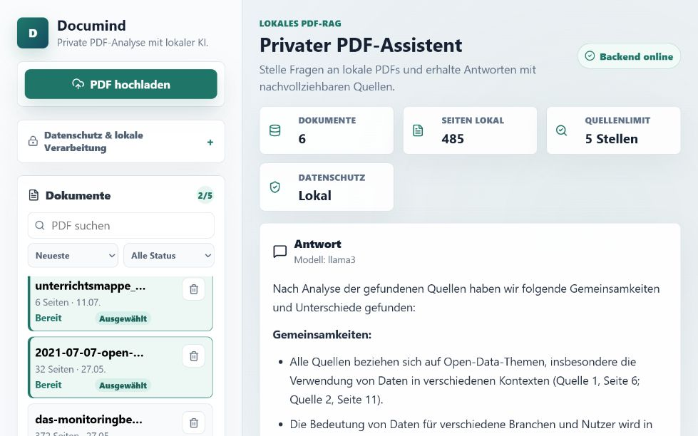
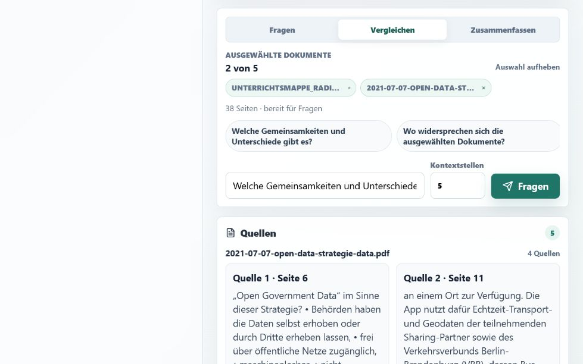
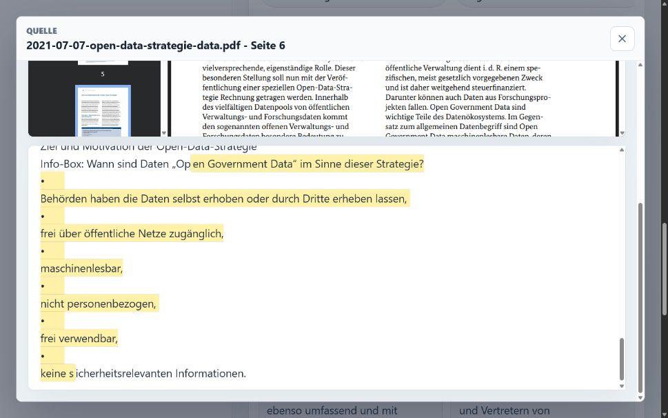

# Documind

Documind ist ein lokaler PDF-Assistent für Windows. Die Anwendung importiert und indexiert PDF-Dokumente auf dem eigenen Rechner, analysiert bis zu fünf Dokumente gemeinsam und beantwortet Fragen mit nachvollziehbaren Quellen bis auf die PDF-Seite.

PDF-Inhalte, Embeddings und KI-Anfragen bleiben lokal. Documind verwendet dafür Ollama und ChromaDB und benötigt weder ein Benutzerkonto noch eine Cloud-API.

> **Projektstatus:** Der vollständige Anwendungsablauf ist implementiert und getestet. Ein eigenständiges NSIS-Setup kann gebaut werden; vor einer Veröffentlichung fehlt noch ein abschließender Installationstest auf einem sauberen Windows-System. Ollama und die benötigten Modelle bleiben bewusst separate lokale Voraussetzungen.

## Vorschau

### Mehrere PDFs gemeinsam analysieren



### Nachvollziehbare, gruppierte Quellen



### Direkter Seitenbezug im PDF



## Funktionen

- Import textbasierter PDFs bis 50 MB
- lokale Textextraktion mit seitenbezogenen Metadaten
- nicht blockierende Indexierungswarteschlange mit Fortschritt
- Abbrechen und erneutes Starten einer Indexierung
- gebündelte Embedding-Anfragen für eine schnellere Verarbeitung
- gemeinsame Analyse von bis zu fünf PDFs
- drei Analysemodi: **Fragen**, **Vergleichen** und **Zusammenfassen**
- dokumentübergreifendes Retrieval mit Relevanzsortierung und Duplikatfilter
- nummerierte und nach Dokument gruppierte Quellen
- eingebettete PDF-Ansicht mit direktem Seitenbezug
- persistente Dokumentauswahl und Analyseeinstellungen
- Dokumentensuche, Statusfilter und Sortierung
- verständliche Lade-, Leer-, Offline-, Fehler- und Wiederholungszustände
- vollständiges Löschen von PDF, Metadaten und Vektordaten
- reproduzierbare Retrieval-Qualitätschecks ohne LLM-Antwort
- React-Oberfläche in einer Tauri-Desktopanwendung

## So funktioniert Documind

1. Eine PDF wird lokal validiert und seitenweise mit PyMuPDF ausgelesen.
2. Der Hintergrundprozess zerlegt den Text in überlappende Abschnitte.
3. Ollama erzeugt die Embeddings in Batches; ChromaDB speichert sie lokal.
4. Für eine Frage sucht Documind pro ausgewähltem Dokument nach relevanten Textstellen.
5. Die Treffer werden global sortiert, nahe Duplikate entfernt und möglichst über die ausgewählten Dokumente verteilt.
6. Das lokale Sprachmodell erzeugt eine Antwort, die auf nummerierte Quellen verweist.
7. Jede Quelle kann direkt auf der zugehörigen PDF-Seite geöffnet werden.

## Datenschutz

Documind ist bewusst als lokale Anwendung konzipiert:

- keine Cloud-Speicherung
- keine Konten oder Synchronisation
- keine externen KI-APIs
- lokale Speicherung von PDFs, Texten, Chunks und Vektordaten
- Ollama-Verbindungen ausschließlich über `localhost`, `127.0.0.1` oder `::1`
- keine lokalen Speicherpfade oder internen Exceptions in API-Antworten
- Upload-Limit von 50 MB

Das Local-First-Konzept schützt vor einer unbeabsichtigten Übertragung an Cloud-Dienste. Es ersetzt jedoch keinen Schutz vor Schadsoftware oder einem bereits kompromittierten Rechner.

## Tech-Stack

| Bereich | Technologie |
| --- | --- |
| Backend | Python 3.11+, FastAPI, Pydantic |
| PDF-Verarbeitung | PyMuPDF |
| Lokales LLM | Ollama, standardmäßig `llama3` |
| Embeddings | Ollama, standardmäßig `nomic-embed-text` |
| Vektorsuche | ChromaDB |
| Frontend | React 19, TypeScript, Vite |
| Desktop | Tauri 2, Rust |
| Tests | pytest, Vitest, Testing Library |
| CI | GitHub Actions |

## Architektur

```text
React UI in Tauri
        |
        | lokales HTTP auf 127.0.0.1:8000
        v
FastAPI Backend
        |
        |-- PDF-Validierung und Textextraktion
        |-- lokale Dokument- und Metadatenspeicherung
        |-- serielle Indexierungswarteschlange
        |-- Chunking und Ollama-Embeddings
        |-- dokumentübergreifendes Retrieval
        `-- lokale Antwortgenerierung mit Quellen
        |
        +--> ChromaDB
        +--> lokales Dateisystem
        `--> Ollama auf 127.0.0.1:11434
```

Weitere Details stehen in der [Architekturdokumentation](docs/architecture.md) und den [RAG-Notizen](docs/rag.md).

## Voraussetzungen

Die unterstützte Entwicklungsumgebung ist Windows mit PowerShell.

- Python 3.11 oder neuer
- Node.js 22 oder neuer
- [Ollama für Windows](https://ollama.com/download/windows)
- für die Desktopentwicklung zusätzlich Rust, Microsoft C++ Build Tools und WebView2

## Schnellstart

### 1. Ollama und Modelle

```powershell
ollama pull llama3
ollama pull nomic-embed-text
```

Ollama muss laufen, bevor PDFs indexiert oder Fragen beantwortet werden können.

### 2. Backend

```powershell
cd backend
python -m venv .venv
.\.venv\Scripts\python.exe -m pip install -r requirements.txt
.\.venv\Scripts\python.exe -m uvicorn main:app --reload --host 127.0.0.1 --port 8000
```

Die API ist unter `http://127.0.0.1:8000` erreichbar. Die Swagger-Oberfläche liegt unter `http://127.0.0.1:8000/docs`.

### 3. Frontend

In einem zweiten PowerShell-Fenster:

```powershell
cd frontend
npm install
npm.cmd run dev
```

Anschließend `http://127.0.0.1:5174` öffnen.

### 4. Desktopentwicklung

Wenn Ollama läuft und `backend/.venv` vorhanden ist, kann Tauri das FastAPI-Backend automatisch starten:

```powershell
cd frontend
npm.cmd run tauri dev
```

Weitere Plattform- und Fehlerhinweise stehen in der [Setup-Dokumentation](docs/setup.md).

## Konfiguration

Die Standardmodelle können über Umgebungsvariablen geändert werden:

```powershell
$env:DOCUMIND_OLLAMA_MODEL="llama3"
$env:DOCUMIND_EMBEDDING_MODEL="nomic-embed-text"
$env:DOCUMIND_EMBEDDING_BATCH_SIZE="16"
```

Ein kleinerer Embedding-Batch benötigt weniger Arbeitsspeicher, erhöht aber die Zahl der Ollama-Anfragen. Ein größerer Batch kann die Indexierung beschleunigen, benötigt jedoch mehr Speicher.

## Tests und Qualitätschecks

```powershell
cd backend
.\.venv\Scripts\python.exe -m pytest

cd ..\frontend
npm.cmd test -- --run
npm.cmd run build

cd ..
```

Zuletzt lokal verifiziert am 13. Juli 2026:

- Backend: **71 Tests bestanden**
- Frontend: **19 Tests bestanden**
- TypeScript-/Vite-Produktionsbuild: **erfolgreich**
- gerenderter Desktop- und Responsive-Test: **erfolgreich**
- echter Vergleich zweier PDFs mit lokaler Ollama-Antwort und fünf Quellen: **erfolgreich**

Für reproduzierbare Retrieval-Prüfungen steht zusätzlich ein LLM-freier Endpunkt zur Verfügung:

```powershell
python scripts\evaluate_rag.py backend\tests\fixtures\rag_quality_cases.example.json
```

Die Beispieldatei muss dafür auf die IDs und erwarteten Seiten lokal indexierter Testdokumente angepasst werden. Das Skript bewertet Dokumentabdeckung, Trefferreihenfolge und optionale Seitenerwartungen.

## API-Beispiel

```powershell
curl.exe -X POST "http://127.0.0.1:8000/rag/ask" `
  -H "Content-Type: application/json" `
  -d '{"document_ids":["DOCUMENT_ID_1","DOCUMENT_ID_2"],"question":"Welche Gemeinsamkeiten und Unterschiede gibt es?","top_k":5,"mode":"compare"}'
```

Die Antwort enthält den verwendeten Modus, das lokale Modell und die nummerierten Quellen. Eine vollständige Übersicht bietet die [API-Dokumentation](docs/api.md).

## Windows-Build

Das Repository enthält einen reproduzierbaren PyInstaller-Build für das lokale Backend:

```powershell
.\scripts\build-backend.ps1 -InstallBuildDependencies
cd frontend
npm.cmd run tauri build
```

Der erste Befehl erstellt `backend/dist/documind-backend.exe` und kopiert die Datei in die Tauri-Ressourcen. Tauri bündelt das Backend und startet es beim Öffnen der Desktopanwendung.

Vor einer Veröffentlichung muss das erzeugte NSIS-Setup noch auf einem sauberen Windows-System geprüft werden. Ollama und die beiden Modelle werden bewusst nicht mitgeliefert.

## Technische Entscheidungen

- Eine serielle Queue verhindert konkurrierende Indexierungen und unkontrollierte Last auf Ollama.
- Embedding-Batches reduzieren die Zahl der lokalen Modellaufrufe.
- Seitenmetadaten bleiben vom PDF-Import bis zur Quellenansicht erhalten.
- Retrieval erfolgt zunächst pro Dokument und anschließend global über alle Treffer.
- Eine Diversitätsauswahl entfernt nahezu identische Chunks und erhält bei ausreichendem Quellenlimit die Dokumentabdeckung.
- Der LLM-freie Retrieval-Endpunkt macht Qualitätsmessungen reproduzierbar.
- Externe Ollama-Aufrufe werden in Tests gemockt; die CI bleibt dadurch deterministisch und privat.

## Bekannte Grenzen

- Scans und reine Bild-PDFs benötigen künftig eine OCR-Erweiterung.
- Die gemeinsame Analyse ist bewusst auf fünf PDFs begrenzt.
- Die Antwortzeit hängt von Hardware, Dokumentumfang und lokalem Ollama-Modell ab.
- Chatverlauf und Exportfunktionen sind noch nicht implementiert.
- Das NSIS-Setup benötigt noch einen Installationstest auf einem sauberen Windows-System.

## Projektstruktur

```text
documind/
|-- .github/workflows/     CI-Checks
|-- backend/               FastAPI, Services, Speicherung und Tests
|-- frontend/              React-Oberfläche und Tauri-Shell
|-- local_data/            ignorierte lokale Dokument- und Vektordaten
|-- scripts/               Build- und Qualitätswerkzeuge
|-- docs/                  Architektur, API, Setup und Projektnotizen
|-- LICENSE
`-- README.md
```

## Dokumentation

- [Setup](docs/setup.md)
- [Architektur](docs/architecture.md)
- [API](docs/api.md)
- [RAG-Notizen](docs/rag.md)
- [Roadmap](docs/roadmap.md)
- [Technische Entscheidungen](docs/entscheidungen.md)
- [Lizenz](LICENSE)
